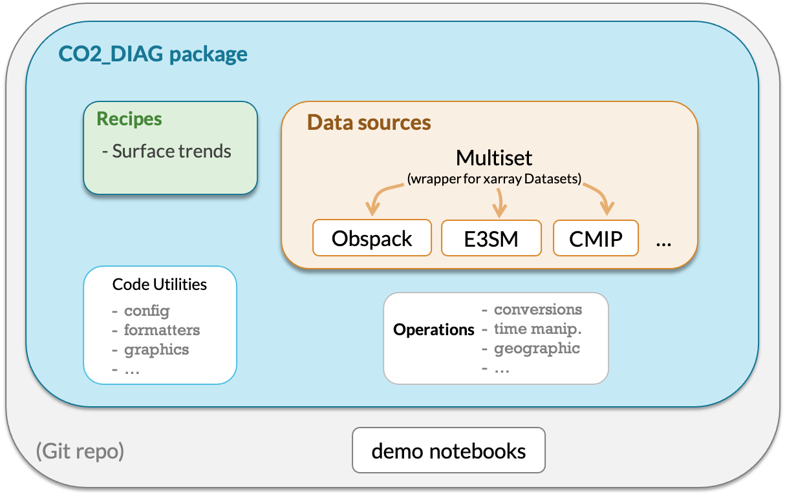

# e3sm_co2_diag

## Overview

This package facilitates comparison of simulated atmospheric CO<sub>2</sub> against observational data. 
Specifically, it selects, loads, and parses the observational datasets and model simulations to be in a consistent structure 
and generates data visualizations for several diagnostic use cases.

#### Motivation

There is a need to evaluate atmospheric CO<sub>2</sub> for continuing development of the Energy Exascale Earth System Model (E3SM)
&mdash; particularly the v2 campaign focused on simulations of global biogeochemistry.

#### Problem to solve

Although there are existing diagnostic tools for Earth System Models
(e.g. ESMValTool, ILAMB, BGC-val), they do not provide functionality specific
for atmospheric CO<sub>2</sub> concentrations.

## Usage

Check out the demonstration notebooks in `notebooks/demo/` 
for how to run recipes for CMIP6 model output, NOAA Globalview+ Obspack, and E3SM model output.

**Note:** It seems that recipes involving CMIP data won't work when on the PNNL VPN
(presumably because the VPN blocks retrieval of the CMIP data catalog using a web URL, which is initiated by the [intake](https://github.com/intake/intake-esm) package).

## Installation

👥 Clone this repository to the location of your choice. 
*Note: most work will be done in the 'develop' branch, 
which we `checkout` before pulling the latest version.*
```shell script
git clone https://github.com/dkauf42/e3sm_co2_diag.git ~/e3sm_co2_diag
cd ~/e3sm_co2_diag/
git checkout develop
git pull
```

🌍 Create conda environment and install dependencies. 
*Note: Replace “myenv” with the preferred name of your environment, e.g. "e3sm_co2_diagnostics". 
From here on we’ll use “myenv” to refer to our environment.*

```shell script
conda create -n "myenv" python=3.8
conda activate "myenv"
conda config --add channels conda-forge
conda install --file requirements.txt
```

💾 Install the package:
```shell script
pip install .
```

## Updating

To use the latest version of this repository:
- Enter the `e3sm_co2_diag/` directory
- Activate your desired environment
- Run the commands:

   ```
   git pull
   git checkout main
   pip install . --upgrade
   ```

## Uninstalling

🚮 To remove this package from your environment:

```
pip uninstall co2_diag
```

## 📁 Project Structure

#### Components



#### Directory Tree
```
e3sm_co2_diag
│
├── README.md                <- Top-level README for users/developers of this project
├── requirements.txt         <- Package dependencies
│
├── notebooks                <- Example jupyter notebooks to see diagnostic capabilities of co2_diag
│   └──demo/
│
├── co2_diag                 <- *Python package* for handling co2 diagnostics
│   │
│   ├── recipes              <- Generate repeatable diagnostics that span multiple data sources available as recipes 
│   │   ├── surface_trends.py
│   │   ├── utils.py
│   │   └── ...
│   │
│   ├── data_source          <- Load, parse, and manipulate data from a particular source
│   │   ├── cmip/
│   │   ├── e3sm/
│   │   ├── obspack/
│   │   ├── datasetdict.py
│   │   ├── multiset.py
│   │   └── ...
│   │
│   ├── operations           <- Manipulate datasets (e.g. spatially or temporally) 
│   │   ├── geographic/
│   │   ├── time/
│   │   ├── convert/
│   │   └── ...
│   │
│   ├── formatters           <- Manipulate formatting in desired ways
│   │   ├── nums.py
│   │   ├── strings.py
│   │   └── ...
│   │
│   ├── graphics             <- Make repeated graphic actions available 
│   │   ├── mapping.py
│   │   ├── utils.py
│   │   └── ...
│   │
│   ├── config               <- Configuration options
│   │   └── log_config.json
│   │
│   └── tests                <- Unit tests for development 
│       ├── test_cmip_collection_recipes.py
│       ├── test_obspack_surface_collection_recipes.py
│       └── test_surface_trends_recipe.py
│
├── MANIFEST.in
└── setup.py
```

## Credits

Major dependencies:

* [pandas](https://pandas.pydata.org/)
* [NumPy](https://www.numpy.org)
* [xarray](http://xarray.pydata.org/en/stable/)

Although not a dependency, ideas were also drawn from [xclim: Climate indices computations](https://github.com/Ouranosinc/xclim).

Funding Acknowledgment:

* Pacific Northwest National Laboratory

## Disclaimer

This is a work in progress.  Bugs are expected.