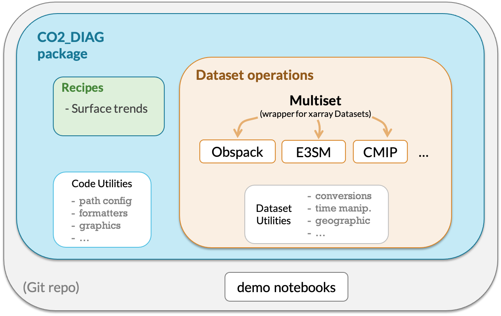

# e3sm_co2_diag
Helper code for evaluating atmospheric CO<sub>2</sub> in E3SM

## Usage

Check out the demonstration notebooks in `notebooks/demo/` 
for how to run recipes for CMIP6 model output, NOAA Globalview+ Obspack, and E3SM model output.


## Installation

###### 👥  Clone this repository to the location of your choice

(Most work will be done in the 'develop' branch, which we `checkout` before pulling the latest version)
```shell script
git clone https://github.com/dkauf42/e3sm_co2_diag.git ~/e3sm_co2_diag
cd ~/e3sm_co2_diag/
git checkout develop
git pull
```

###### 🌍  Create conda environment and install dependencies:

💥 Important: Replace “myenv” with the preferred name of your environment, e.g. "e3sm_co2_diagnostics". 
From here on we’ll always use “myenv” to refer to our environment.

```shell script
conda create -n "myenv" python=3.8
conda activate "myenv"
conda config --add channels conda-forge
conda install --file requirements.txt
```

###### 💾  Install the package:
```shell script
pip install .
```

## 🚮 Updating

To use the latest version of this repository:
- Enter the `e3sm_co2_diag/` directory
- Activate your desired environment
- Run the commands:

   ```
   git pull
   git checkout main
   pip install . --upgrade
   ```

## 🚮 Uninstalling

To uninstall the python packages from your environment (site-packages):

```
pip uninstall bayota
```

## 📁 Project Structure

#### Components



#### Directory Tree
```
e3sm_co2_diag
│
├── README.md                <- Top-level README for users/developers of this project.
├── requirements.txt         <- Package dependencies.
│
├── notebooks                <- Example jupyter notebooks to see diagnostic capabilities of co2_diag.
│   └──demo/
│
├── co2_diag                 <- *Python package* for handling co2 diagnostics.
│   │
│   ├── config               <- Configuration options.
│   │   └── log_config.json
│   │
│   ├── dataset_operations   <- Modules to load, parse, and manipulate data from various sources.
│   │   ├── cmip/
│   │   ├── e3sm/
│   │   ├── obspack/
│   │   ├── multiset.py
│   │   └── ...
│   │
│   ├── formatters           <- Manipulate formatting in desired ways.
│   │   ├── nums.py
│   │   ├── strings.py
│   │   └── ...
│   │
│   ├── graphics             <- Make repeated graphic actions available. 
│   │   ├── mapping.py
│   │   ├── utils.py
│   │   └── ...
│   │
│   └── recipes              <- Make repeated diagnostics that span multiple data sources available as recipes. 
│       ├── surface_trends.py
│       ├── utils.py
│       └── ...
│
│
├── MANIFEST.in
└── setup.py
```

## Credits

Major dependencies:

* [pandas](https://pandas.pydata.org/)
* [NumPy](https://www.numpy.org)
* [xarray](http://xarray.pydata.org/en/stable/)

Funding Acknowledgment:

* Pacific Northwest National Laboratory

## Disclaimer

This is a work in progress.  Bugs are expected.