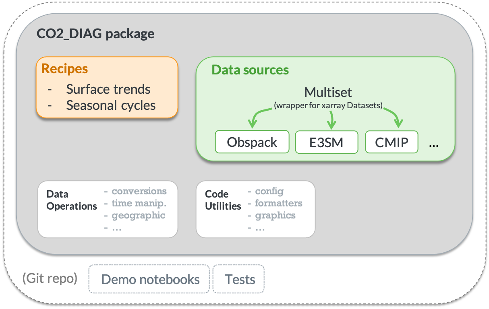

# Greenhouse gas Diagnostics for Earth System Simulations

[](https://github.com/dkauf42/e3sm_co2_diag/actions/workflows/lint_and_test.yml)
[](https://codecov.io/gh/dkauf42/e3sm_co2_diag)
[](https://www.python.org/downloads/release/python-380/)

[comment]: <> ([![latest version]&#40;https://img.shields.io/badge/Current%20version-0.01a1-brightgreen.svg&#41;]&#40;https://github.com/dkauf42/e3sm_co2_diag/releases/tag/0.01b1&#41;)

## Overview

GDESS facilitates comparison of simulated atmospheric CO<sub>2</sub> against observational data. 
Specifically, it selects, loads, and parses the observational datasets and model simulations to be in a consistent structure 
and generates data visualizations for several diagnostic use cases.

#### Motivation

There is a need to evaluate atmospheric CO<sub>2</sub> for continuing development of U.S. Department of Energy's Energy Exascale Earth System Model (E3SM)
&mdash; particularly the v2 campaign focused on simulations of global biogeochemistry.

#### Problem to solve

Although there are existing diagnostic tools for Earth System Models
(e.g. ESMValTool, ILAMB, BGC-val), they do not provide functionality specific
for atmospheric CO<sub>2</sub> concentrations.

## Data requirements and availability

- **Globalview+ data** 
  - For parsing and running demo notebooks, one must first download Obspack, 
which is available from the NOAA Global Monitoring Laboratory (GML) here:
<https://www.esrl.noaa.gov/gmd/ccgg/obspack/data.php>
  - There is a sample file from NOAA GML included in this Git repository to enable the running of test cases.

- **CMIP6** 
  - It seems that recipes involving CMIP data won't work when on the PNNL VPN
(presumably because the VPN blocks retrieval of the CMIP data catalog using a web URL, 
which is initiated by the [intake](https://github.com/intake/intake-esm) package).
  
- **E3SM**
  - For parsing and running demo notebooks, 
    one must have access to model output history as NetCDF file(s).

## Usage

Diagnostic recipes can be run from the command line or from within a Python kernel.

- **Command line**
  - Use `~/e3sm_co2_diag/co2_diag/bin/gdess --help` to see the available commands
  - To specify options from a file [recommended for repeated tests], use the `@` symbol prefix for the filename. 
    E.g. `~/e3sm_co2_diag/co2_diag/bin/gdess @recipe_options_file.txt` 


- **In a Python kernel** 
  - check out the demonstration notebooks in `notebooks/demo/` for how to run recipes for CMIP6 model output, 
    NOAA Globalview+ Obspack, and E3SM model output.

## Installation

👥 Clone this repository to the location of your choice.
```shell script
git clone https://github.com/dkauf42/e3sm_co2_diag.git ~/e3sm_co2_diag
```

🌍 Create conda environment and install dependencies. 
*Note: Replace “myenv” with the preferred name of your environment, e.g. "co2_diagnostics". 
From here on we’ll use “myenv” to refer to our environment.*

```shell script
conda create -n myenv python=3.8
conda activate myenv
conda config --add channels conda-forge
conda install --file requirements.txt
```

💾 Install the package:
```shell script
cd ~/e3sm_co2_diag/
pip install .
```

## Updating

To use the latest version of this repository:
- Enter the `e3sm_co2_diag/` directory
- Activate your desired environment
- Run the commands:

   ```
   git pull
   git checkout main
   pip install . --upgrade
   ```

## Uninstalling

🚮 To remove this package from your environment:

```
pip uninstall co2_diag
```

## Developing

Most work will be done in the 'develop' branch, 
so please `git checkout develop` or create a new branch before modifying code.

## 📁 Project Structure

#### Components



#### Directory Tree
```
e3sm_co2_diag
│
├── README.md                  <- Top-level README for users/developers of this project
├── requirements.txt           <- Package dependencies
│
├── notebooks                  <- Example jupyter notebooks to see diagnostic capabilities of co2_diag
│   └──demo/
│
├── co2_diag                   <- *Python package* for handling co2 diagnostics
│   │
│   ├── bin                  
│   │   └── codima.py          <- Run recipes from the command line
│   │
│   ├── recipes                <- Generate repeatable diagnostics that span multiple data sources available as recipes 
│   │   ├── surface_trends.py
│   │   ├── seasonal_cycles.py
│   │   ├── utils.py
│   │   └── ...
│   │
│   ├── data_source            <- Load, parse, and manipulate data from a particular source
│   │   ├── cmip/
│   │   ├── e3sm/
│   │   ├── obspack/
│   │   ├── datasetdict.py
│   │   ├── multiset.py
│   │   └── ...
│   │
│   ├── operations             <- Manipulate datasets (e.g. spatially or temporally) 
│   │   ├── geographic/
│   │   ├── time/
│   │   ├── convert/
│   │   └── ...
│   │
│   ├── formatters             <- Manipulate formatting in desired ways
│   │   ├── nums.py
│   │   ├── strings.py
│   │   └── ...
│   │
│   ├── graphics               <- Make repeated graphic actions available 
│   │   ├── mapping.py
│   │   ├── utils.py
│   │   └── ...
│   │
│   └── config                 <- Configuration options
│       └── log_config.json
│    
├── tests                      <- Unit tests for development 
│   ├── test_cmip_collection_recipes.py
│   ├── test_obspack_surface_collection_recipes.py
│   └── test_surface_trends_recipe.py
│
├── MANIFEST.in
└── setup.py
```

## Credits

#### Dependencies

- `ccgcrv`: The curve fitting code in the ccgcrv directory has been mildly modified &mdash; 
  modified for improved code integration, i.e. the computational logic has not been changed &mdash; 
  from the code made freely available by the NOAA Global Monitoring Laboratory. 
From their website, one can access the [source code](https://www.esrl.noaa.gov/gmd/aftp/user/thoning/ccgcrv/) 
and read a [description of its usage](https://www.esrl.noaa.gov/gmd/ccgg/mbl/crvfit/crvfit.html). 
Additional details regarding the curve fitting approach can be found in the following publications:
  - Thoning, K.W., P.P. Tans, and W.D. Komhyr, 1989, Atmospheric carbon dioxide at Mauna Loa Observatory, 2. Analysis of the NOAA/GMCC data, 1974 1985., J. Geophys. Res. ,94, 8549 8565. https://doi.org/10.1029/JD094iD06p08549
  - Sweeney, C., Karion, A., Wolter, S., Newberger, T., Guenther, D., Higgs, J.A., Andrews, A.E., Lang, P.M., Neff, D., Dlugokencky, E., Miller, J.B., Montzka, S.A., Miller, B.R., Masarie, K.A., Biraud, S.C., Novelli, P.C., Crotwell, M., Crotwell, A.M., Thoning, K., Tans, P.P., 2015. Seasonal climatology of CO 2 across North America from aircraft measurements in the NOAA/ESRL Global Greenhouse Gas Reference Network. J. Geophys. Res. Atmos. 120, 5155–5190. https://doi.org/10.1002/2014JD022591

* [pandas](https://pandas.pydata.org/)
* [NumPy](https://www.numpy.org)
* [xarray](http://xarray.pydata.org/en/stable/)

Although not a dependency, ideas were also drawn from [xclim: Climate indices computations](https://github.com/Ouranosinc/xclim).

#### Funding Acknowledgment:

* Data were obtained from the Energy Exascale Earth System Model project, 
  sponsored by the U.S.Department of Energy, Office of Science, Office of Biological and Environmental Research.
* Pacific Northwest National Laboratory

## Disclaimer

This is a work in progress.  Bugs are expected.