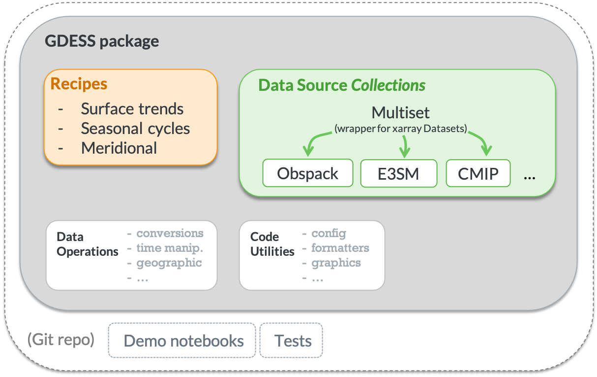

# Greenhouse gas Diagnostics for Earth System Simulations

<!-- Information badges -->
[](https://github.com/dkauf42/gdess/actions/workflows/lint_and_test.yml)
[](https://codecov.io/gh/dkauf42/gdess)
[](https://www.python.org/downloads/release/python-380/)
[](https://joss.theoj.org/papers/6cc7ba8d3c09f66974550161f740e176)

[comment]: <> ([![latest version]&#40;https://img.shields.io/badge/Current%20version-0.01a1-brightgreen.svg&#41;]&#40;https://github.com/dkauf42/gdess/releases/tag/0.01b1&#41;)

## Overview

GDESS facilitates comparison of simulated atmospheric CO<sub>2</sub> against observational data. 
Specifically, it selects, loads, and parses the observational datasets and model simulations to be in a consistent structure 
and generates data visualizations for several diagnostic use cases. 
Three diagnostic recipes currently implemented examine multidecadal trends, seasonal cycles, and meridional gradients.


#### Motivation

There is a need to evaluate atmospheric CO<sub>2</sub> for continuing development of U.S. Department of Energy's Energy Exascale Earth System Model (E3SM)
&mdash; particularly the v2 campaign focused on simulations of global biogeochemistry.

#### Problem to solve

Although there are existing diagnostic tools for Earth System Models
(e.g. ESMValTool, ILAMB, BGC-val), they do not provide functionality specific
for atmospheric CO<sub>2</sub> concentrations.

## Contents

* [Data requirements and availability](#data-requirements-and-availability)
* [Getting started](#getting-started)
* [Example](#example)
* [Usage](#usage-description)
* [Updating](#updating)
* [Uninstalling](#uninstalling)
* [Contributing](#contributing)
* [Project structure](#project-structure)
* [Credits](#credits)
* [Disclaimer](#disclaimer)

## Data requirements and availability

**Observations - Globalview+ data** 
  - For parsing and running demo notebooks, one must first download the Obspack, 
which is available from the NOAA Global Monitoring Laboratory (GML) here:
<https://www.esrl.noaa.gov/gmd/ccgg/obspack/data.php>
  - There is a sample file from NOAA GML included in this Git repository to enable the running of test cases.

**Model Output - CMIP6** 
  - CMIP6 data do not need to be downloaded before running recipes, 
as GDESS can use the intake-esm dependency to retrieve CMIP6 data programmatically while running.
  - It seems that recipes involving CMIP data won't work when on the PNNL VPN
(presumably because the VPN blocks retrieval of the CMIP data catalog using a web URL, 
which is initiated by the [intake](https://github.com/intake/intake-esm) package).
  
**Model Output - E3SM**
  - E3SM outputs do not need to be available to run recipes that compare Globalview+ and CMIP6 data.
  - For parsing and running recipes from E3SM Collection, 
    one must have access to model output history as NetCDF file(s), 
and a script for post-processing E3SM output is provided in `gdess/bin/`.

## Getting started

### Installation

👥 Clone this repository to the location of your choice.
```shell script
git clone https://github.com/E3SM-Project/gdess.git ~/gdess
cd ~/gdess
```

🌍 Create conda environment and install dependencies. 
*Note: Replace “myenv” with the preferred name of your environment, e.g. "gdess_env". 
From here on we’ll use “myenv” to refer to our environment.*

```shell script
conda create -n myenv python=3.8
conda activate myenv
conda config --add channels conda-forge
conda install --file requirements.txt
```

💾 Install the package:
```shell script
pip install .
```

To run the tests, now retrieve the example data files using:
```shell
git lfs install
git lfs pull
```

### Configuration

Instead of passing data filepaths to the recipe functions each time, 
you can define environment variables for the directory containing Globalview+ Obspack
and CMIP model output.

##### On a Mac/Linux OS:
- Specify the path to the repo on the first line of `gdess/bin/set_path_vars.sh`. 
For instance, by executing: `export GDESS_REPO=${HOME}/gdess`
- Set paths to the test data by running the script at the command line:
```shell
source ./gdess/bin/set_path_vars.sh
```
- To use stored data other than the test data, modify the other data paths in the scripts. 
For example, to set the paths for every future terminal instance (and if you are running in a bash environment), 
set these paths in your `~/.bash_profile`:
```bash
export GDESS_CMIP_DATA=Path/to/Model/Output/NetCDF/Files
export GDESS_GLOBALVIEW_DATA=Path/to/Obspack/NetCDF/Files
```

##### On a Windows OS:
- Follow the instructions provided in `./gdess/bin/set_path_vars.bat`


[comment]: <> (These variables are retrieved in the `gdess/config/defaults.ini` file.)

## Example

- The following steps generate this figure:


  1. Install the `gdess` package according to the [installation](#installation) instructions
  2. Follow the [configuration](#configuration) instructions to use the included example data files
  3. 
```./gdess/bin/gdess_cli.py --verbose seasonal --start_yr 1980 --end_yr 2015 --model_name BCC.esm-hist --cmip_load_method local --station_list smo```

- Other examples are given in the provided jupyter notebooks, 
which show recipe usage (`trends_recipe.ipynb`, `seasonal_cycle_recipe.ipynb`, and `meridional_recipe.ipynb`). To run them:
  1. Enable your conda environment via: `python -m ipykernel install --user --name=myenv`
  2. Start jupyter by entering: `jupyter notebook`
  3. Navigate within jupyter to `gdess/notebooks/demo/`

## Usage description

Diagnostic recipes can be run from the command line or from within a Python kernel:

**Command line**
  - Use `gdess/bin/gdess_cli.py` followed by the recipe name and then recipe options. To see available commands, run, e.g. `gdess/bin/gdess_cli.py --help` or `gdess/bin/gdess_cli.py seasonal --help`  
  - To specify options from a file [recommended for repeated tests], use the `@` symbol prefix for the filename. 
    For example, using the provided file: `gdess/bin/gdess_cli.py @recipe_options_example.txt` 


**In a Python kernel** 
  - The diagnostic recipes can be called directly, with options passed as a Python `dict` object.
  - Check out the demonstration notebooks in `gdess/notebooks/demo/`. The notebooks show recipe usage.

## Updating

To use the latest version of this repository:
- Enter the `gdess/` directory
- Activate your desired environment
- Run the commands:

   ```
   git pull
   git checkout main
   pip install . --upgrade
   ```

## Uninstalling

🚮 To remove this package from your environment:

```
pip uninstall gdess
```

## Contributing

If you're interested in participating in the development of `gdess`, 
want to suggest features or report bugs, 
please leave us a message through the [issue tracker](https://github.com/E3SM-Project/gdess/issues).

Note that most work is done in the 'develop' branch, 
so please `git checkout develop` 
(or you can create a new branch) before modifying code.

## Project structure

#### Components



#### Directory Tree
```
gdess
│
├── README.md                            <- Top-level README for users/developers of this project
├── requirements.txt                     <- Package dependencies
├── recipe_options_example.txt
│
├── notebooks                            <- Example jupyter notebooks to see diagnostic capabilities of gdess
│   └──demo/
│
├── gdess                                <- *Python package* for handling co2 diagnostics
│   │
│   ├── bin                  
│   │   ├── gdess_cli.py                 <- Run recipes from the command line
│   │   ├── set_path_vars.sh             <- Script to set up data file paths for running examples
│   │   └── concat_and_remap_E3SM_co2.sh <- Script template for post-processing of E3SM output
│   │
│   ├── recipes                          <- Generate repeatable diagnostics that span multiple data sources available as recipes 
│   │   ├── surface_trends.py
│   │   ├── seasonal_cycles.py
│   │   ├── meridional_gradient.py
│   │   ├── recipe_utils.py
│   │   └── ...
│   │
│   ├── data_source                      <- Load, parse, and manipulate data from a particular source
│   │   ├── models/
│   │   ├── observations/
│   │   ├── multiset.py
│   │   └── ...
│   │
│   ├── operations                       <- Manipulate datasets (e.g. spatially or temporally) 
│   │   ├── Confrontation.py
│   │   ├── geographic.py
│   │   ├── time.py
│   │   ├── convert.py
│   │   ├── datasetdict.py
│   │   └── ...
│   │
│   ├── formatters                       <- Manipulate formatting in desired ways
│   │   ├── args.py
│   │   ├── nums.py
│   │   ├── strings.py
│   │   └── ...
│   │
│   ├── graphics                         <- Make repeated graphic actions available 
│   │   ├── comparison_plots.py
│   │   ├── single_source_plots.py
│   │   ├── utils.py
│   │   └── ...
│   │
│   ├── config                           <- Configuration options
│   │   ├── defaults.ini
│   │   ├── stations_dict.json
│   │   └── log_config.json
│   │   
│   └── recipe_parsers.py
│
├── tests                                <- Unit and integration tests for development 
│   └── ...
├── ccgcrv                               <- Curve fitting code from NOAA GML (see credits in the README)  
│   └── ...
├── ci                                   <- Environment specification for continuous integration  
│   └── ...
├── paper                                <- Manuscript for the Journal of Open Source Software (JOSS)  
│   └── ...
│
├── LICENSE
├── MANIFEST.in
├── setup.cfg
└── setup.py
```

## Credits

#### Dependencies

The full list of dependencies is in the `requirements.txt` file. 

#### Additional acknowledgements

- Although not a dependency, ideas were also drawn from [xclim: Climate indices computations](https://github.com/Ouranosinc/xclim).
- `ccgcrv`: The curve fitting code in the ccgcrv directory has been mildly modified &mdash; 
  modified for improved code integration, i.e. the computational logic has not been changed &mdash; 
  from the code made freely available by the NOAA Global Monitoring Laboratory. 
From their website, one can access the [source code](https://www.esrl.noaa.gov/gmd/aftp/user/thoning/ccgcrv/) 
and read a [description of its usage](https://www.esrl.noaa.gov/gmd/ccgg/mbl/crvfit/crvfit.html). 
Additional details regarding the curve fitting approach can be found in the following publications:
  - Thoning, K.W., P.P. Tans, and W.D. Komhyr, 1989, Atmospheric carbon dioxide at Mauna Loa Observatory, 2. Analysis of the NOAA/GMCC data, 1974 1985., J. Geophys. Res. ,94, 8549 8565. https://doi.org/10.1029/JD094iD06p08549
  - Sweeney, C., Karion, A., Wolter, S., Newberger, T., Guenther, D., Higgs, J.A., Andrews, A.E., Lang, P.M., Neff, D., Dlugokencky, E., Miller, J.B., Montzka, S.A., Miller, B.R., Masarie, K.A., Biraud, S.C., Novelli, P.C., Crotwell, M., Crotwell, A.M., Thoning, K., Tans, P.P., 2015. Seasonal climatology of CO 2 across North America from aircraft measurements in the NOAA/ESRL Global Greenhouse Gas Reference Network. J. Geophys. Res. Atmos. 120, 5155–5190. https://doi.org/10.1002/2014JD022591

- The Mauna Loa (MLO), American Samoa (SMO), South Pole (SPO), and Barrow Observatory (BRW) dataset files 
used in the tests directory was provided via the Obspack (GLOBALVIEWplus_v6.0_2020-09-11) by:
C. D. Keeling, S. C. Piper, R. B. Bacastow, M. Wahlen, 
T. P. Whorf, M. Heimann, and H. A. Meijer, Exchanges of atmospheric CO2 and 13CO2 with the terrestrial biosphere
and oceans from 1978 to 2000.  I. Global aspects, SIO Reference
Series, No. 01-06, Scripps  Institution of Oceanography, San Diego, 88
pages, 2001.

#### Funding:

* This work is made possible by the Pacific Northwest National Laboratory.
* Data were obtained from the Energy Exascale Earth System Model project, 
  sponsored by the U.S.Department of Energy, Office of Science, Office of Biological and Environmental Research.

## Disclaimer

This is a work in progress.  Bugs are expected.